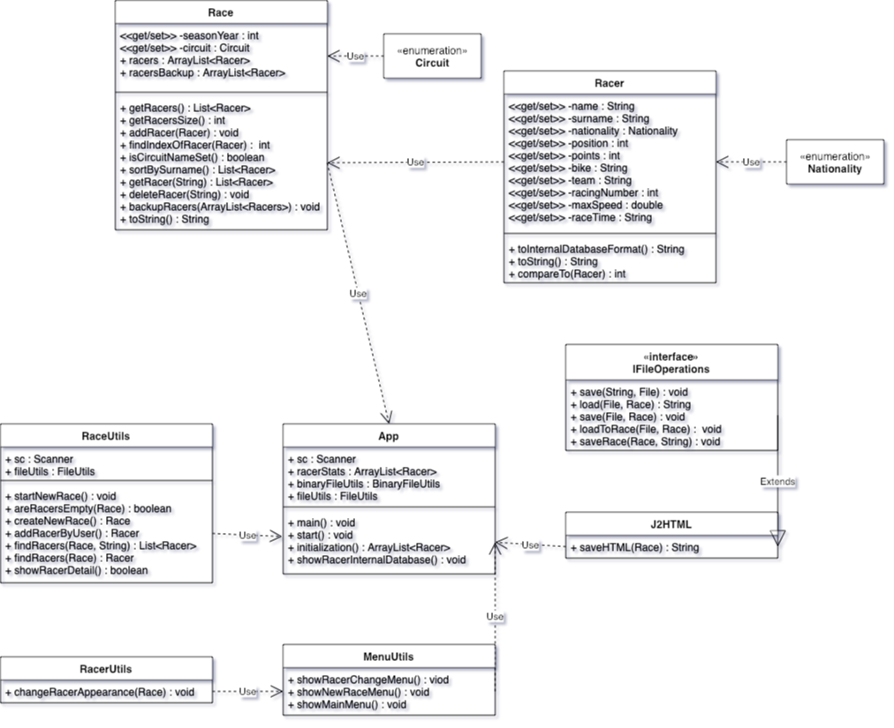

# Semestrální práce - RaceResults

## Abstrakt

Program **RaceResults** bude zpracovávat výsledky motocyklových závodů. Vstupem programu budou textové soubory - seznam okruhů pořádajících závod, seznam jezdců a výsledky. Soubor se seznamem okruhů bude uchovávat informace o trati (poloha, délka, nejrychlejší čas na kolo). Seznam jezdců bude nést data o aktuálně zúčastněných jezdcích. Do souboru s výsledky se zaznamená pořadí jezdců, jak projeli cílovou páskou. Jednotlivé údaje budou v souborech oddělené jednou nebo více mezerami. Program má umožnit načíst vstupní soubory a vypsat zpracované výsledky příslušného termínu. Výsledky požadujeme vypsat seřízené podle dosažených bodů, nebo abecedně podle příjmení. Výpis je volitelně na obrazovku, nebo do souboru.

Aplikace v souborech uchovává seznam závodníků a přiřazuje jim data - umístění v daném závodě, maximální rychlost během závodu atd. Dále umožňuje vytvářet nové závody a upravovat data závodníků.

**Cílem** práce je uchovat data závodníků a přehledně je zobrazit-


## Funkční specifikace
Aplikace běží v konzolovém menu:

### 1. zobrazit výsledky závodu
- načíst data data ze souboru
- zobrazit data
- uložit data 
### 2. zahájit nový závod
- vytvořit závod
    - přidat závodníky
    - upravit závodníky
    - smazat závodníky
- uložit závod do souboru
### 3. upravit v načteném závodě závodníka
- zobrazí samostaně závodníka
### 4. vypsat detail závodníků
- vypíše pohled do interní databáze
### 5. uložit načtené závodníky
- uloží načtené závodníky do souboru (CircuitSeasonYear.csv)
### 6. uložit načtené závodníky do binárního souboru
### 7. načíst závodníky z binárního soubor
### 8. uložit závodníky do HTML
- uloží závodníky do souboru index.html

## Popis řešení

**jaké datové typy bude obsahovat, čím budou odděleny jednotlivé údaje, jestli je požadovaný určitý formát názvů souborů a pod.**
## Formát souborů
Úkolem aplikace je přehledně zobrazit zaznamenaná data zvýsledků závodů na silničním okruhu. 
Data jsou načítána ze souborů s příponou *.csv*, oddělena pomocí středníku. Každý soubor musí mít **hlavičku**, která charakterizuje uložené data. 

Ukládání do souborů se drží zavedené struktury.

Další možností je uložení dat do binárního souboru, které je jedním z požadavků. Zde se ukládají závodníci a jejich zisk bodů. Tento způsob má simulovat interní databázi, jelikož binární soubory nejsou čitelné běžným prohlížečem, můžeme předpokládat, že naše data jsou v bezpečí a dokud bude způsob ukládání tajný, budou data "zašifrovaná". Mimo jiné aplikace nabízí možnost uložit data do těla HTML souboru a následně je zobrazit na webové stránce, to bude popsáno v kapitole o použité **externí knihovně**.


## Class diagram



## Testování
| Číslo testu | Typ testu, popis |Očekávaný výsledek |Skutečný výsledek| Prošel (ano/ne)|
|---|---|---|---|---|---|
| 1 |Zadání neplatné hodnoty v **hlavním menu**|Výpis chybové hlášky: *Neplatná volba*|Program zůstal v hlavním menu a vypsal chybovou hlášku|ano|
| 2 |Zadání chybného názvu souboru při načítání|Program se vrátí do hlavního **menu**|Program se vrátil do hlavního **menu**|ano|
| 3 |Zahájení nového závodu, zadání roku <1949 *začátek závodění*|Program se vrátí zpět do hlavního menu bez výstupu|Program ukončil vytváření nového závodu a vrátil se do hlavního menu|ano|
| 4 |Zahájení nového závodu, zadání roku >aktuální rok|Program přeruší vytváření a navrátí se do hlavního menu|Program se vrátil do hlavního menu|ano|
| 5 |Zahájení nového závodu, zadání nevalidního okruhu|Program opět přestane vytvářet nový záznam závodu|Program ukončil činnost a vrátil se do hlavního menu|ano|
| 6 |Vytváření závodu -> smazat závodníka dříve, než alespoň jednoho přidáme|Program vrátí hlášku, že nejdříve musíme závodníka přidat|program vrátil hlášku, že nejprve musíme závodníka přídat|ano|
| 7 |Vytváření závodu -> editace neexistujícího závodníka|Program zůstane v menu přidávání/editace/mazání závodníků|Program zůstal v menu|ano|
| 8 |Editace údajů závodníka -> chybná hodnota|Program vrátí hlášku, s neplatným formátem dat|Program ukončil editaci a vrátil hlášku|ano|
| 9 |Hlavní menu -> uložení nenačtení závodníků|Program uživatele upozorní, že závodníky je potřeba nejdříve načíst|Program podal hlášku, že závodníky je potřeba nejdříve načíst|ano|
| 10|Upravit v nenačteném závodě závodníka|Hláška, že nejdříve je nutno načíst závod|Hláška: ***Nejdřív musíte načíst závod!***|ano|


## Popis fungování externí knihovny

**J2HTML**, jak už název napovídá, je knihovna pro sestavování těla HTML souborů. 

**Použití:**

```java
package utils;

import app.Race;
import app.Racer;
import static j2html.TagCreator.*;
import java.util.List;

public final class J2HTML {

private J2HTML() {

}

public static String saveHTML(Race race) {
	List<Racer> racers = race.getRacers();

	return body(
		h1(String.format("%d %s", race.getSeasonYear(), 		race.getCircuitName())), h3(String.format("%s\t".repeat(10),
		" Pozice", " Jméno",
		"Příjmení", "Národnost", "Tým", "Motocykl", "Startovní číslo", "Maximální rychlost", "Čas", "Počet bodů")),
		div(each(racers, racer -> div(h5(racer.toString()))))
		).render();
	}
}
```
